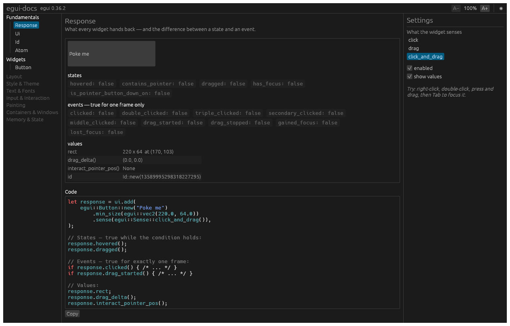

# egui-docs

An interactive, explained guide to [`egui`](https://github.com/emilk/egui).

**[Try it in your browser →](https://rado31.github.io/egui-docs/)**

Every topic is one page with four things on it at once: a **live widget**, the **settings**
that drive it, the **code** that would produce exactly what you see, and an **explanation**
of why it works that way.

Turn a knob and both the widget and the code change — because both are generated from the
same state. The snippet cannot drift from the thing it documents.



## Why

egui has two good sources of truth, and a gap between them:

- [egui.rs](https://www.egui.rs/#demo) shows you widgets, but not what makes them work.
- [docs.rs/egui](https://docs.rs/egui/0.36.2) explains every item, but shows you nothing.

Neither teaches the fundamentals — `Ui`, `Response`, `Id`, `Sense`, `Atom` — that everything
else in egui is built on. This project is an attempt at the missing middle.

## Status

Early. Five lessons exist:

- **Fundamentals** — `Response`, `Ui`, `Id`, `Atom`
- **Widgets** — `Button`

Planned: layout, style & theme, text & fonts, input & interaction, painting,
containers & windows, memory & state. The sidebar lists them greyed out, so the shape of
the guide is visible while it is being built.

Pinned to **egui 0.36.2**. That version changed a lot (`eframe::App::ui` replaced `update`,
`Panel` replaced `SidePanel`/`TopBottomPanel`), so most egui material you will find online no
longer compiles. Everything here is written against 0.36.

## Running it

```sh
cargo run
```

In a browser:

```sh
rustup target add wasm32-unknown-unknown
cargo install --locked trunk        # or: brew install trunk
trunk serve --release
```

## How a lesson works

A lesson is a single type implementing [`Lesson`](src/lesson.rs). It owns its settings as
plain fields, and two methods read those same fields:

- `demo(&mut Ui)` — builds and shows the real widget
- `code() -> String` — builds the snippet, from the same values

Because both derive from one source, the code on screen always matches the widget above it.
[`src/lessons/button.rs`](src/lessons/button.rs) is the reference implementation.

## Adding a lesson

1. `src/lessons/<name>.rs` — implement `Lesson`
2. `src/lessons/mod.rs` — add it to `all()`
3. `tests/snapshots.rs` — add a `render_lesson(...)` test

`src/app.rs` does not change; it only knows `dyn Lesson`.

## Tests

`cargo test` renders every lesson headlessly with
[`egui_kittest`](https://docs.rs/egui_kittest) and compares the result against the PNGs in
`tests/snapshots/` — the same images used in this README. Layout regressions show up as an
image diff.

```sh
cargo test                      # check
UPDATE_SNAPSHOTS=1 cargo test   # accept the current rendering as the new baseline
```

## License

Dual-licensed under either of

- Apache License, Version 2.0 ([LICENSE-APACHE](LICENSE-APACHE) or
  <https://www.apache.org/licenses/LICENSE-2.0>)
- MIT license ([LICENSE-MIT](LICENSE-MIT) or <https://opensource.org/licenses/MIT>)

at your option — the same terms as `egui` itself.

Unless you explicitly state otherwise, any contribution intentionally submitted for
inclusion in this work by you, as defined in the Apache-2.0 license, shall be dual-licensed
as above, without any additional terms or conditions.
